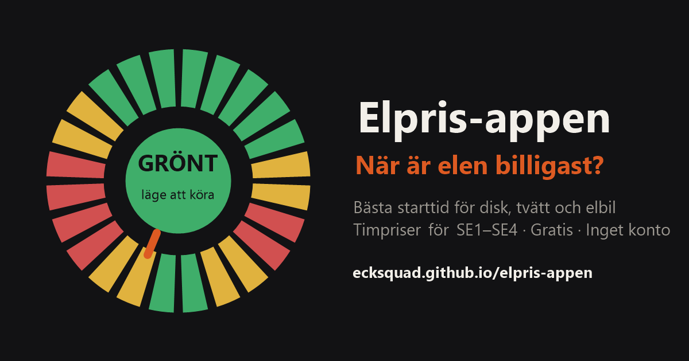

# Elpris-appen ⚡ — när är elen billigast?

**[👉 Öppna appen](https://ecksquad.github.io/elpris-appen/)** — gratis, inget konto, funkar direkt i mobilen.

De flesta elpris-appar visar *vad* elen kostar. Den här säger istället **när du ska starta** —
diskmaskinen, tvättmaskinen, torktumlaren, duschen eller elbilsladdningen.

## Vad den gör

- ⏰ **24-timmars urtavla** med trafikljus i navet: grönt = kör nu, gult/rött = vänta, med nedräkning till nästa gröna timme
- 🍽️ **Apparatkort** som räknar ut billigaste sammanhängande fönstret i de kommande 36 timmarna: "Bäst start 22:00 · Spara 3,80 kr"
- 🚗 **Elbilsladdning** med total kostnad för hela sessionen
- 🕐 **Tillåten starttid per apparat** — duschen föreslås aldrig kl 04, och tvättmaskinen kan hållas borta från nätterna
- 📲 **Spara på hemskärmen** — appen är en PWA och funkar som en vanlig app
- 🇸🇪 Alla fyra elområden (SE1–SE4), svensk text, mörkt tema

## Data & integritet

- Spotpriser (timpriser) från Nord Pool via [elprisetjustnu.se](https://www.elprisetjustnu.se) — öppet och gratis API
- Alla priser visas **exkl. skatter och avgifter** (påslag, energiskatt, moms och elnätsavgift tillkommer på din faktura)
- Inget konto, ingen spårning, ingen server — dina inställningar sparas bara i din webbläsare (localStorage)
- Hela appen är en enda statisk sida på GitHub Pages

## Kör själv

Det är bara statiska filer — forka repot och slå på GitHub Pages, eller öppna `index.html` lokalt.

## Stöd

Om appen sparar dig några kronor: [☕ ko-fi.com/ecksquad](https://ko-fi.com/ecksquad)
